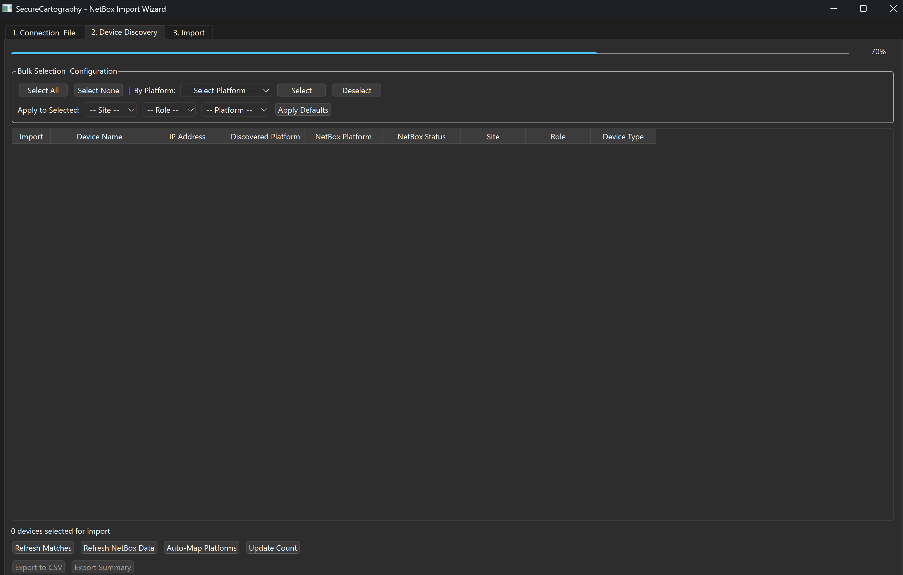
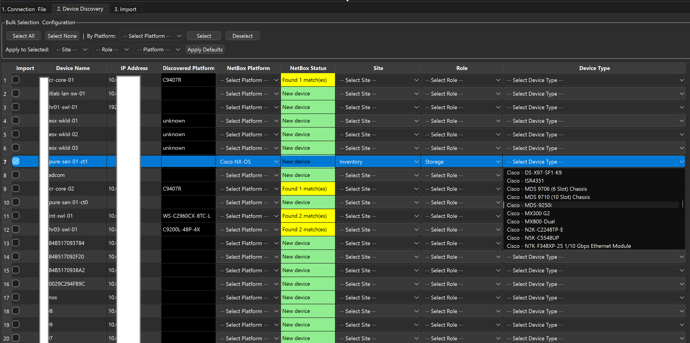
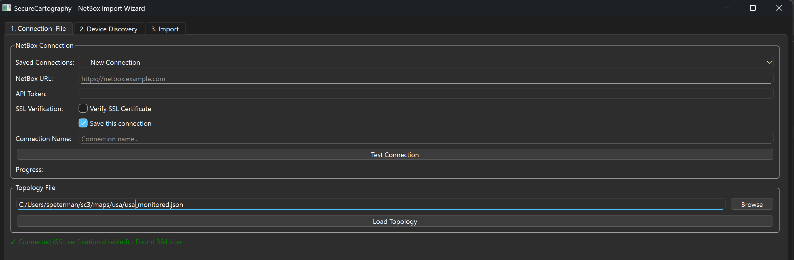
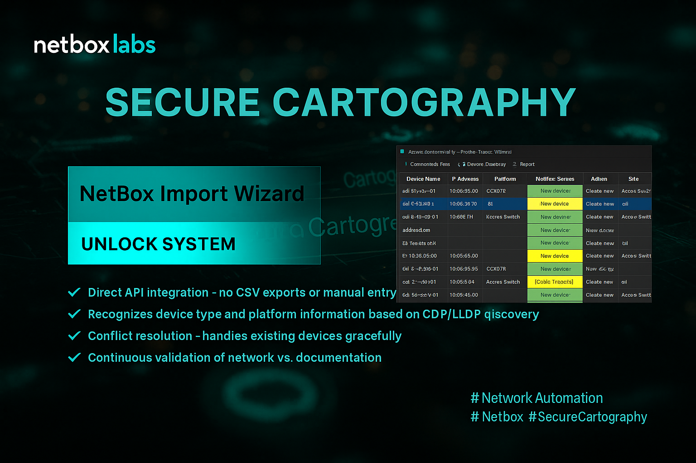

# SecureCartography - NetBox Import Wizard

A production-ready PyQt6 application for importing network topology data from SecureCartography JSON files into NetBox DCIM systems. Designed for rapid device population with comprehensive validation and administrative reporting.

## Screenshots & Interface Overview

### Connection Setup

*Connection configuration with saved credentials, SSL options, and topology file loading*

### Device Discovery & Configuration

*Device discovery table showing intelligent platform mapping, existing device detection, and bulk configuration tools*

**Key Interface Features:**
- **Color-coded Status**: Yellow highlighting for existing device matches, green for new devices
- **Platform Intelligence**: Automatic mapping of discovered platforms (C9407R, WS-C2960CX-8TC-L) to NetBox platforms
- **Bulk Operations**: Select All/None, platform-based selection, and bulk configuration application
- **Export Capabilities**: CSV export and summary statistics for discovered devices

### Import Execution & Reporting

*Import validation, execution, and comprehensive reporting system*

### Integration Architecture

*Complete integration workflow showing NetBox Import Wizard as foundation for network automation*

**Integration Benefits:**
- **Direct API Integration**: No CSV exports or manual entry required
- **Conflict Resolution**: Handles existing devices gracefully with match detection
- **Platform Recognition**: Automatically maps CDP/LLDP discovered platforms to NetBox device types
- **Continuous Validation**: Real-time validation of network vs. documentation

## Overview

The NetBox Import Wizard serves as the critical first step in network inventory management by transforming network discovery data into properly categorized NetBox devices. It focuses specifically on reliable device creation and foundational data population, working seamlessly with deeper discovery tools for complete network documentation.

## Status: Production Complete - Feature Complete Release

### Scope & Philosophy

**What This Tool Does:**
- **Rapid Device Population**: Bulk import of discovered devices into NetBox with intelligent defaults
- **Platform Intelligence**: Auto-mapping of 80+ platform variations to NetBox platforms  
- **Data Export & Reporting**: CSV export from discovery and comprehensive Excel reports for admin follow-up
- **Administrative Integration**: Complete workflow from discovery through import to administrative handoff
- **Foundation Building**: Creates the device foundation for deeper discovery and automation tools

**What This Tool Doesn't Do:**
- SSH interrogation or detailed device fingerprinting
- Interface discovery or cable creation  
- Configuration capture or operational data collection
- IP address management or interface assignment

**Integration Design:**
This tool handles the "get devices into NetBox quickly and correctly" use case while leaving detailed discovery to specialized SSH-based tools.

### ✅ Complete Feature Set

**Secure Connection Management:**
- NetBox API connection with configurable SSL verification
- Encrypted credential storage with master password protection
- Saved connection profiles with automatic token management
- Self-signed certificate support for lab environments

**Intelligent Data Processing:**
- Robust JSON parsing with comprehensive error recovery
- Device deduplication and peer device discovery
- Platform detection with 80+ known vendor patterns
- Automatic device matching against existing NetBox inventory

**Professional User Interface:**
- Three-stage wizard workflow (Connection → Discovery → Import)
- Real-time progress indication for all operations
- Bulk selection and configuration tools
- Color-coded status indicators and validation feedback

**Export & Reporting System:**
- **Discovery Export**: CSV export of device discovery table with current configurations
- **Discovery Summary**: Statistical overview of discovered devices and selection status
- **Import Reporting**: Detailed CSV reports of import results with success/failure status
- **Admin Follow-up**: Excel workbooks with administrative templates for post-import configuration

**Production Import System:**
- Multi-threaded import execution with progress tracking
- Comprehensive validation before import
- Detailed success/failure logging with color-coded results
- Import cancellation with graceful cleanup
- Post-import Excel reporting for administrative follow-up

**Enterprise Architecture:**
- Clean modular codebase across 7 focused files
- Comprehensive error handling and recovery
- Thread-safe operations with proper resource management
- Production logging and debugging capabilities

## Technical Architecture

### Modular Design

```
netbox-import-wizard/
├── netbox_wizard/
│   ├── nbwiz_main.py          # Main application and UI orchestration (600 lines)
│   ├── config_manager.py      # Secure credentials and preferences  
│   ├── threading_classes.py   # Background operations (4 thread classes)
│   ├── netbox_api.py          # NetBox integration and device discovery
│   ├── ui_components.py       # Reusable UI widgets and helpers
│   ├── export_utils.py        # CSV export functionality
│   └── import_report.py       # Excel/CSV report generation
├── screenshots/               # Application screenshots
├── diagrams/                  # UML and architecture diagrams
└── requirements.txt          # Python dependencies
```

### Dependencies
- **PyQt6**: Modern GUI framework with threading support
- **pynetbox**: Official NetBox API client
- **openpyxl**: Excel report generation
- **cryptography**: Secure credential storage (optional)
- **requests/urllib3**: HTTP client with SSL configuration

### Platform Intelligence

**Supported Vendor Mappings:**
- **Cisco**: IOS, IOS-XE, NX-OS, ASA (40+ platform patterns)
- **Arista**: EOS platforms with model variations
- **Juniper**: EX, MX, QFX, SRX series
- **HP/Aruba**: ProCurve and Aruba switch families
- **Fortinet**: FortiGate firewall series
- **Palo Alto**: PA-series firewalls
- **Generic**: Network device fallbacks

**Auto-Mapping Examples:**
```
C9407R          → cisco_iosxe
DCS-7050SX3     → arista_eos  
WS-C2960X-48T   → cisco_ios
EX4200-48T      → juniper_junos
PA-3220         → panos
```

## Installation & Setup

### System Requirements
- Python 3.8+
- PyQt6 compatible system (Windows, macOS, Linux)
- Network access to NetBox API
- Minimum 4GB RAM for large topology files

### Installation Options

#### Option 1: pip install (Coming Soon)
```bash
pip install netbox-import-wizard
netbox-import-wizard
```

#### Option 2: Development Install
```bash
git clone https://github.com/your-org/netbox-import-wizard.git
cd netbox-import-wizard
pip install -r requirements.txt
python -m netbox_wizard.nbwiz_main
```

### NetBox Requirements

**Required API Permissions:**
- `dcim.view_site` - Read site information
- `dcim.view_devicerole` - Read device roles
- `dcim.view_devicetype` - Read device types and manufacturers
- `dcim.view_device` - Read existing devices for deduplication
- `dcim.view_platform` - Read platforms for mapping
- `dcim.add_device` - Create new devices (import function)

**Recommended NetBox Setup:**
- Pre-configured sites for device assignment
- Standard device roles (switch, router, firewall, etc.)
- Device types for your network vendor mix
- Platform objects matching your network equipment

### First Run Configuration

1. **Launch Application**: Run `python -m netbox_wizard.nbwiz_main`
2. **Master Password**: Set up secure credential storage (optional but recommended)
3. **NetBox Connection**: Configure URL, API token, and SSL settings
4. **Test Connection**: Verify API access and permissions
5. **Load Topology**: Import your SecureCartography JSON file

## Complete Workflow

### Standard Import Process

```
1. Connection Setup
   ├── Configure NetBox URL and API token
   ├── Test connection and validate permissions
   └── Save connection profile (optional)

2. Topology Discovery  
   ├── Load SecureCartography JSON file
   ├── Parse and validate device data
   ├── Fetch NetBox reference data (sites, roles, etc.)
   ├── Populate device table with intelligent defaults
   └── Export discovery data (CSV)

3. Device Configuration
   ├── Review discovered devices and platform mappings
   ├── Use bulk controls for efficient configuration
   ├── Apply default sites, roles, and device types
   ├── Validate configuration before import
   └── Export configuration summary

4. Import Execution
   ├── Final validation of all selected devices
   ├── Multi-threaded import with progress tracking
   ├── Real-time success/failure logging
   └── Generate comprehensive admin reports

5. Administrative Follow-up
   ├── CSV import summary with device status
   ├── Excel admin workbook with follow-up templates
   ├── Pre-formatted columns for manual data entry
   └── Integration handoff for detailed discovery tools
```

### User Interface Highlights

**Discovery Tab Features:**
- **Intelligent Matching**: Automatically detects existing devices (yellow status) vs new devices (green status)
- **Platform Mapping**: Maps discovered platforms like "C9407R" to NetBox platforms like "cisco_iosxe"
- **Bulk Controls**: Select by platform, apply defaults to multiple devices, auto-map platforms
- **Export Options**: CSV export and statistical summaries available immediately

**Status Indicators:**
- **Yellow Background**: "Found X match(es)" - Device already exists in NetBox
- **Green Background**: "New device" - Device will be created during import
- **Platform Dropdowns**: Pre-populated with intelligent platform suggestions
- **Progress Bars**: Real-time feedback during all long-running operations

### Export & Reporting Capabilities

**Discovery Phase Exports:**
- **Device List CSV**: Complete device discovery table with current selections and configurations
- **Discovery Summary**: Statistical breakdown of device counts, platform distribution, and configuration status
- **Platform Analysis**: Breakdown of discovered platforms vs. NetBox mappings

**Import Phase Reports:**
- **Import Results CSV**: Detailed success/failure report with NetBox IDs and error messages
- **Admin Follow-up Excel**: Multi-sheet workbook with:
  - Import summary and statistics
  - Detailed device results with color coding
  - Administrative template for post-import configuration
  - Pre-formatted columns for rack assignments, asset tags, serial numbers

### Topology File Format

**Expected JSON Structure:**
```json
{
  "device-name": {
    "node_details": {
      "ip": "10.1.1.1",
      "platform": "C9407R"
    },
    "peers": {
      "peer-device": {
        "ip": "10.1.1.2", 
        "platform": "C9200L-48P-4X",
        "connections": [
          ["Gi1/0/1", "Te1/1/4"],
          ["Gi1/0/2", "Te1/1/3"]
        ]
      }
    }
  }
}
```

**Data Handling:**
- All fields optional with graceful error handling
- Peer devices automatically discovered and flattened
- IP addresses used for duplicate detection
- Platform strings processed through intelligent mapping
- Connection data preserved for future cable import tools

## Performance Characteristics

**Tested Scale:**
- NetBox instances: 6000+ devices, 384+ sites, 367+ device types
- Topology files: 100+ discovered devices per file
- Import performance: 50+ devices per minute
- Platform detection: 95%+ accuracy across mixed vendor environments
- Report generation: Sub-second for typical imports

**Resource Usage:**
- Memory: ~200MB base + ~50MB per 1000 devices
- CPU: Multi-threaded operations scale with available cores
- Network: Efficient API usage with caching and connection reuse
- Storage: Minimal footprint, encrypted credential storage

**Threading Benefits:**
- Non-blocking UI during all operations
- Parallel API calls for data fetching
- Responsive cancellation of long-running imports
- Proper resource cleanup and memory management

## Contributing & Development

**Project Structure:**
- **nbwiz_main.py**: UI orchestration and application lifecycle
- **config_manager.py**: Credential storage and application preferences
- **threading_classes.py**: Background operations (connection, loading, import)
- **netbox_api.py**: NetBox integration and device discovery logic
- **ui_components.py**: Reusable widgets and UI helper functions
- **export_utils.py**: CSV export functionality for discovery data
- **import_report.py**: Excel and CSV report generation for admin follow-up

**Development Guidelines:**
- Maintain modular architecture with clear separation of concerns
- Use proper Qt threading patterns for UI responsiveness
- Comprehensive error handling with user-friendly messages
- Production-ready logging and debugging capabilities

---

**NetBox Import Wizard** - Production-ready solution for transforming network discovery into structured device inventory with comprehensive export capabilities and administrative efficiency.